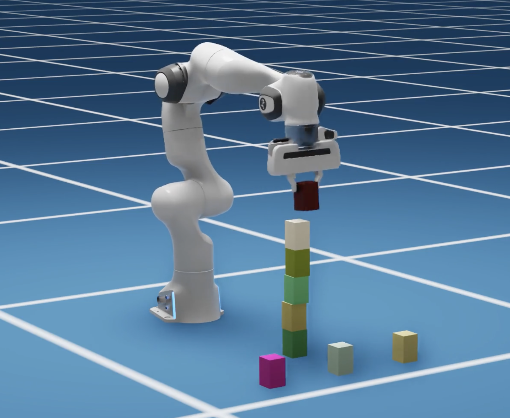

# Written Assignment - Robotics

In a cube-stacking task, multiple cubes are in the front of a robot. The robot is tasked to stack these blocks together. The extents of the blocks are given.

For simplicity, we assume that the poses of the blocks and the robot are all known. we pick each cube from its top, perpendicular to the ground, so you can assume the end-effector pose for grasping each cube can be directly computed from the cube's pose.

> The image is from [NVIDIA cuRobo Docs](https://curobo.org/advanced_examples/2_block_stacking_example.html).

Discuss in your report on how to implement a block stacking with robot motion planners following the guidelines:

1. [3 pts] Write a pseudo code for performing this task. Use functions like `motion_plan(...)` to represent the APIs you need, and discuss what arguments should be provided and how to compute them.
2. [1 pts] When grasping a cube, directly planning the robot to the grasping pose will likely make the end-effector colliding with the cube. Can you come up with any simple strategy to avoid this?
3. [1 pts] Open question: If the simplicity assumptions cannot be fulfilled, and the robot is equipped with a depth camera, discuss what essential modules and procedures for the robot to finish the task.
